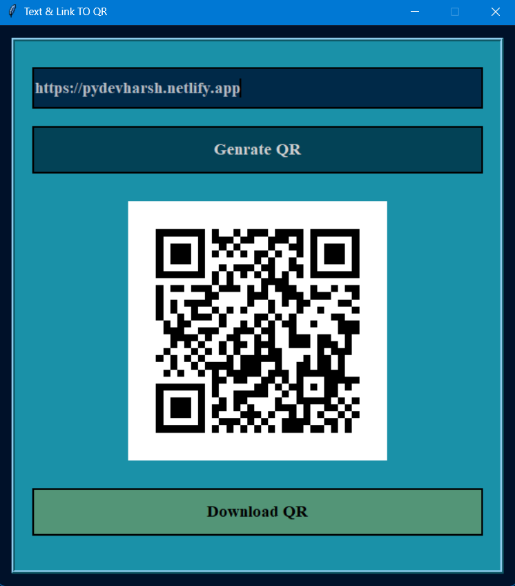

# 🔳 QR Code Generator (GUI Based)

A beginner-friendly yet practical **GUI-based QR Code Generator** built using **Python & Tkinter**.

🚀 This project demonstrates how Python libraries and GUI development can be combined to create a real-world utility application for generating and downloading QR codes.

---

## 📌 Project Overview

This application allows users to generate QR codes from **text or URLs** and download them as image files.

Unlike basic scripts, this project focuses on:

- Clean UI design
- Real-world usability
- Simple yet effective functionality

---

## 🧠 How It Works

The application uses the **qrcode library** to generate QR images dynamically.

➡️ User enters text or link
➡️ System generates QR code instantly
➡️ QR is displayed in the GUI
➡️ User can download the QR as a PNG file

This makes it:

- Fast ⚡
- Lightweight 🪶
- Practical 🔧

---

## ✨ Key Features

✔ Generate QR codes from text or links
✔ Clean and responsive GUI using Tkinter
✔ Real-time QR preview
✔ Download QR as PNG
✔ Beginner-friendly and scalable code

---

## 🛠 Tech Stack

| Technology | Purpose            |
| ---------- | ------------------ |
| Python     | Core Programming   |
| Tkinter    | GUI Development    |
| qrcode     | QR Code Generation |
| Pillow     | Image Processing   |

---

## 📸 GUI Preview

<p align="center">
  
</p>

---

---

## 🎥 Demo

<p align="center">
  
</p>

---

## 📂 Project Structure

```
QR_Code_Generator/
│
├── main.py
├── assets/
│   └── preview.png
│   └── preview.mp4
│
├── requirements.txt
├── README.md
```

---

## ▶️ How to Run

### 1. Clone the repository

```bash
git clone https://github.com/pydevharsh/QR_Code_Generator.git
cd QR_Code_Generator
```

### 2. Install dependencies

```bash
pip install -r requirements.txt
```

### 3. Run the application

```bash
python main.py
```

---

## 💡 How to Use

1. Enter any text or URL
2. Click **Generate QR**
3. Click **Download QR** to save the image

---

## 📚 Learning Outcomes

Through this project, you will learn:

- GUI development using Tkinter
- Working with external Python libraries
- Image handling using Pillow
- File saving using file dialogs
- Building real-world utility applications

---

## 🚀 Future Improvements

- 🎨 Custom QR colors
- 🖼 Add logo inside QR
- 📂 Save history of generated QR codes
- 🎨 Enhanced UI/UX design
- 🔗 Bulk QR generation

---

## 👨‍💻 Author

**Harsh Chaudhary**
India 🇮🇳

---

## ⭐ Support

If you found this project useful:

👉 Give it a ⭐ on GitHub
👉 Share feedback
👉 Suggest improvements

---

## 📢 Final Note

This project reflects my journey of applying Python concepts to build practical tools.

> “Learning by building — one project at a time.” 🚀
